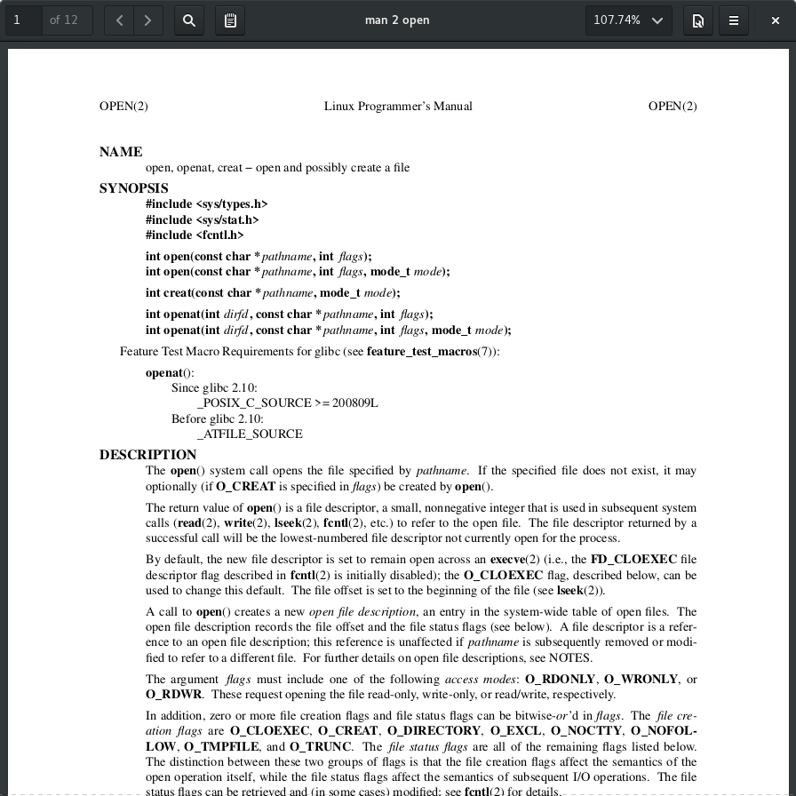

# pan

Ephemeral PDF Man Page Viewer

## Usage

Just like man for displaying pages. Invokes man, converts its output to PDF then displays it.

### Example:

```
[~]$ pan 2 open
```



## Installation
```
[~]$ sudo cp pan.sh /etc/profile.d
```